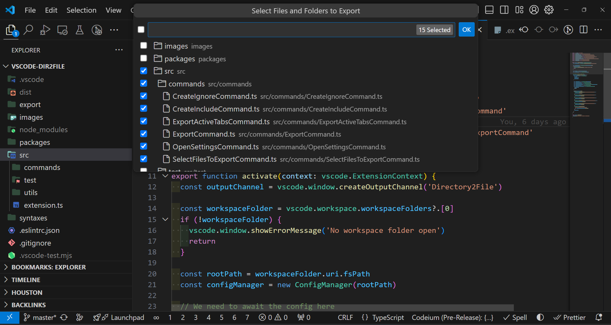

# Export Directory to File

[[Marketplace page](https://marketplace.visualstudio.com/items?itemName=cogscides.directory2file)] - [🚧 WIP]

## Description

This VSCode extension allows you to export all files in a directory to a single file with support for ignoring and including specific files or patterns. It's particularly useful for exporting files for AI analysis, documentation purposes, or creating comprehensive snapshots of your project.

## Features

- Export all files in a directory to a single file (default: `export.md`).
- Selective file export using the "Select files to export" command.
- Support for ignoring and including files using configurable rules.
- Set global ignore filepath rules from settings.
- Option to include project structure in the exported Markdown file.
- Option to remove comments from code files.
- Export active tabs only.
- Configurable through `exportconfig.json`.

## Commands

- `Dir2file: Export Directory to File`: Exports the entire directory to the output file.
- `Dir2file: Select Files to Export`: Opens a QuickPick menu to select specific files for export.
- `Dir2file: Export only active tabs`: Exports only the currently open tabs.
- `Dir2file: Create/Edit ignore File`: Creates or edits the ignore file.
- `Dir2file: Create/Edit include File`: Creates or edits the include file.
- `Dir2file: Open Settings`: Opens the extension settings in VSCode.

## Select Files to Export

The "Select Files to Export" command provides a user-friendly way to choose which files to include in your export. Here's how it looks:



This feature allows you to:

- Browse your project structure in a tree view.
- Select or deselect individual files and folders.
- Quickly select or deselect all files within a folder.
- Save your selection for future use.

## Configuration

Create an `exportconfig.json` file in the root of your workspace to configure the extension:

```json
{
  "output": "export.md",
  "description": "",
  "ignoreFile": ".export-ignore",
  "includeFile": ".export-whitelist",
  "maxFileSize": 1048576,
  "removeComments": true,
  "includeProjectStructure": true
}
```

### Configuration Options

- `output`: Path to the output file (default is `export.md`).
- `description`: String or Object with `main` and `activeTabs` properties for custom descriptions.
- `ignoreFile`: Path to the file containing ignore patterns (default is `.export-ignore`).
- `includeFile`: Path to the file containing include patterns (default is `.export-include`).
- `maxFileSize`: Maximum file size in bytes to process (default is 1048576 or 1MB).
- `removeComments`: Whether to remove comments from code files (default is `true`).
- `includeProjectStructure`: Whether to include the project structure in the exported file (default is `true`).

## Ignore and Include Rules

The extension uses two separate files to manage which files are included or excluded from the export:

### Ignore Rules (`.export-ignore`)

The ignore file uses patterns similar to `.gitignore` to specify which files and directories should be excluded from the export. For example:

```
node_modules/
*.log
dist/
.vscode/
```

- `directory/` will ignore the directory and its contents but show it in the tree structure.
- `directory/**` will ignore the directory and its contents, excluding it from the tree structure.
- Use `*.ext` to ignore all files with a specific extension.

### Include Rules (`.export-whitelist`)

The include file specifies which files or patterns should be explicitly included in the export, even if they match ignore patterns. For example:

```
src/**/*.js
README.md
docs/*.md
"extension.ts"
```

- Use `**` for recursive matching.
- Specify exact filenames or use wildcards.
- Use quotes for explicit filenames, e.g., `"extension.ts"` to include a specific file regardless of its location.

When both ignore and include rules are present, the include rules take precedence. This means you can include specific files or directories that would otherwise be ignored.

## How It Works

The extension's core functionality is implemented in the `FileProcessor` class. Here's a breakdown of the main logic:

1. **Initialization**: The `FileProcessor` loads ignore and include rules from the configuration files and global settings.

2. **File Processing**:

   - The `processDirectory` method walks through the directory structure.
   - For each file, it calls `shouldProcessFile` to determine if the file should be included.
   - `shouldProcessFile` checks if the file is ignored and/or explicitly included.
   - If a file is both ignored and included, the user is prompted to decide.

3. **Rule Application**:

   - Ignore rules are applied using the `ignore` package, which supports gitignore-style patterns.
   - Include rules are processed in the `shouldIncludeFile` method:
     - Explicit filenames (in quotes) are matched exactly.
     - Directory wildcards (e.g., `src/**`) include all files in that directory and subdirectories.
     - File wildcards (e.g., `*.js`) match files with specific extensions.

4. **Content Processing**:

   - Files are read and their content is extracted.
   - If `removeComments` is enabled, comments are stripped from supported file types.
   - Large files (exceeding `maxFileSize`) are skipped.

5. **Output Generation**:

   - Processed file contents are combined into a single Markdown file.
   - If enabled, a project structure tree is included at the beginning of the file.

6. **Active Tabs Export**:

   - The `ExportActiveTabsCommand` handles exporting only the currently open tabs.
   - It uses the same `FileProcessor` logic but only for the active document URIs.

7. **Select Files to Export**:
   - The `SelectFilesToExportCommand` creates a tree view of the project structure following the ignore rules.
   - Users can interactively select files and folders to export.
   - Selections are saved and can be reused in future exports.

## Usage

1. Install the extension from the VSCode marketplace.
2. [Optional] Create and configure the `exportconfig.json` file in your project root.
3. Use the "Create/Edit ignore File" and "Create/Edit include File" commands to set up your file filters.
4. Run "Export Directory to File" to export all files, or "Select Files to Export" to choose specific files.
5. Find your exported file at the location specified in your configuration.

## Tips

- Use the "Select Files to Export" command for more granular control over which files are included.
- Regularly update your ignore and include files as your project structure changes.
- Use explicit filenames in quotes (e.g., `"extension.ts"`) in the include file to ensure specific files are always included.
- Experiment with the `removeComments` option to reduce the size of your exported file.
- Use the "Export only active tabs" feature for quick exports of your current work.
- Global ignore rules can be set in VSCode settings, which apply to all projects.

## Feedback and Contributions

Feedback and contributions are welcome! Please open an issue on our GitHub repository if you encounter any problems or have suggestions for improvements.

## Alternatives found

- [aiformat](https://github.com/farouqaldori/aiformat) - CLI tool
- [code2prompt](https://github.com/raphaelmansuy/code2prompt) - CLI tool
